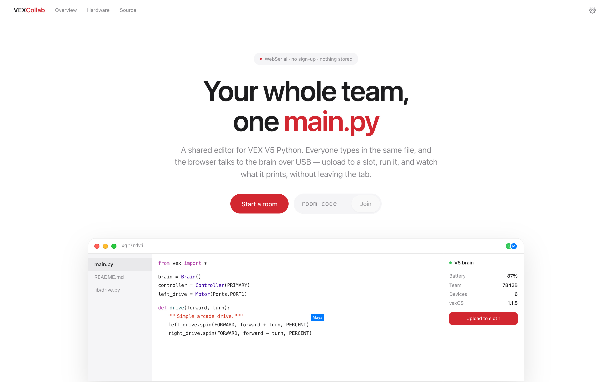
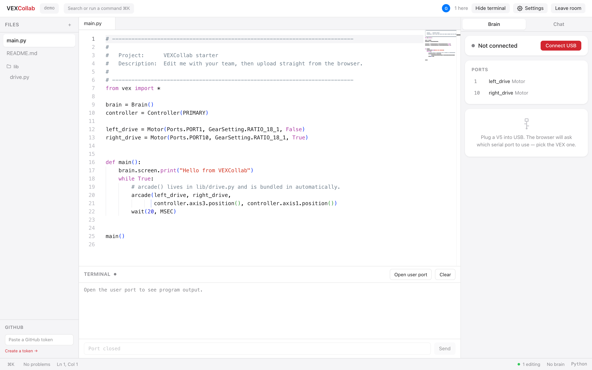
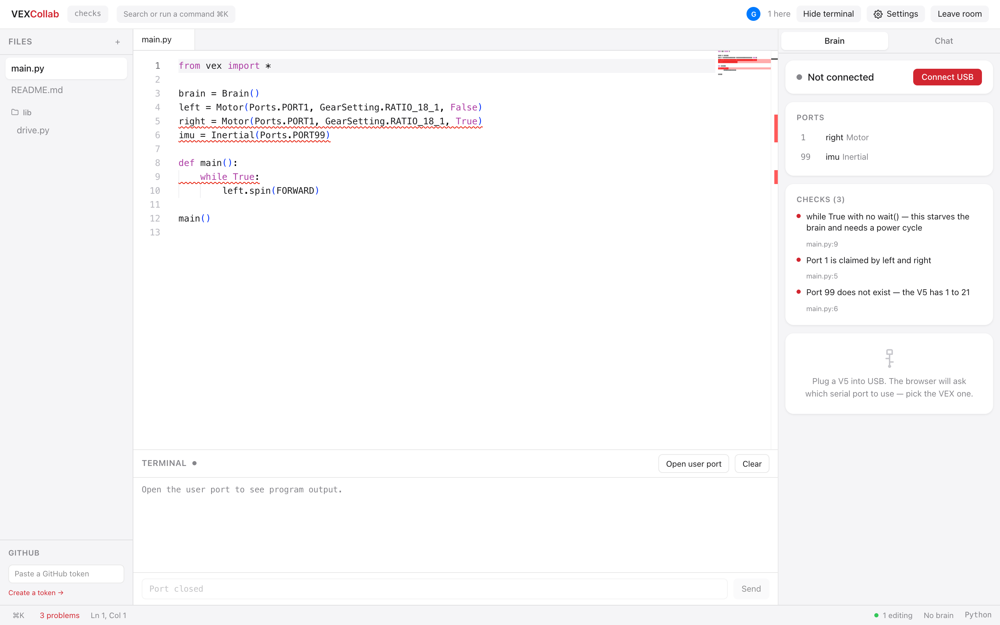
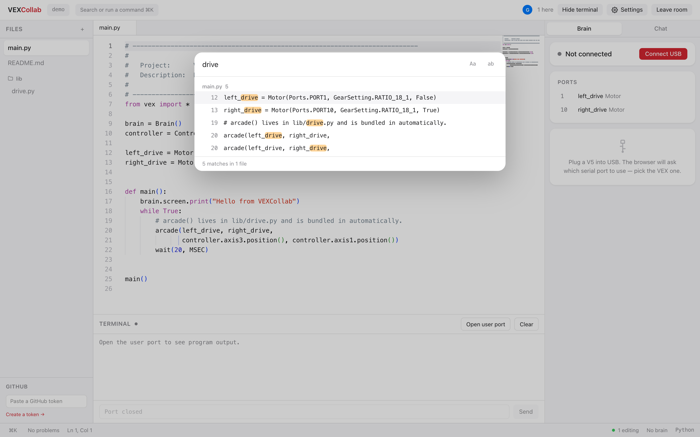

# VEXCollab

**Google Docs, but for VEX V5 Python.** Your team edits one file together in a
browser, then sends it straight to the robot over USB. No IDE to install, no
toolchain, no accounts.

```bash
npx github:ponpon77/vexcollab
```



It prints two links:

```
On this computer   http://localhost:3000      ← the laptop with the USB cable
On your Wi-Fi      http://192.168.0.211:3000  ← send this to your team
```

Click **Start a room**, pick what it should start with, share the link, and
everyone is typing in the same file.

**Four templates** — Starter, Blank, Competition (autonomous and driver control,
split the way a match runs), and Drivetrain (drive in millimetres, turn in
degrees). Or **start from a GitHub repo** and it clones straight into the room.

> **You need Chrome, Edge or Opera** for the USB parts — Safari and Firefox can't
> talk to USB devices. Node 20+ to run it. The first launch takes a couple of
> minutes to set itself up; after that it starts in about two seconds.

---

## What it looks like



Left is your files. Middle is the editor. Right is your robot. The terminal at the
bottom shows whatever your program prints.

---

## It knows VEX, not just Python

This is the part a normal editor can't do.



In that screenshot the code has three real problems, and VEXCollab found all of
them before anything reached the robot:

| What's wrong | Why it matters |
| --- | --- |
| `while True` with no `wait()` | Locks the brain up. You have to power-cycle it |
| Two motors both on **PORT1** | Only one of them will work |
| **PORT99** doesn't exist | The V5 has ports 1 to 21 |

The **PORTS** panel lists every device your code declares. Plug in a robot and it
adds what the brain *actually* reports — so if your code says port 7 is a motor and
the brain says port 7 is empty, you can see it. That mismatch is behind a lot of
"but it worked yesterday".

---

## Find anything — ⌘⇧F



Searches every file in the room at once. Click a result to jump straight to it.

---

## What you can do with the robot

Plug a V5 into USB, press **Connect USB**, and pick the VEX port when the browser
asks. Then you get:

- **Send a compiled `.bin`** to any slot, run it, stop it
- **Watch it run** — anything your program prints appears in the terminal
- **Live graphs** — print `heading=12.4` and it draws itself as a chart
- **Test autonomous** without a competition switch, by flipping the brain between
  disabled / driver / autonomous
- **See everything about the robot** — battery, firmware, every port, both
  controllers, radio signal, files on the brain
- **Update vexOS**

If your program crashes, the error message becomes clickable — press it and you
land on the line that broke.

---

## Working together

- Everyone's cursor shows up in their own colour with their name on it
- Add and delete files; everyone sees it instantly
- Rooms are just links. No sign-up, and nothing is saved to disk — a room
  disappears when the last person leaves

**Save your work to GitHub:** sign in, pick a repo (or make a new one), and press
*Save session to GitHub*. It commits and pushes for you.

---

## Editor features

- Type `left_drive.` and get the real VEX API, with explanations
- Type `motor.spin(FORWARD, 50, ` and it offers `PERCENT`, `RPM`, `DPS` — only
  what actually fits there
- Click a name to highlight everywhere else it's used
- Hover anything to see what it is
- Red underlines for typos and syntax mistakes
- ⌘K for the command palette, ⌘⇧F to search, ⌘J for the terminal
- Light or dark, your choice — plus six editor colour schemes and eight
  monospace fonts, with a live preview in Settings

---

## Three things to know

**1. USB needs a secure connection.** Browsers only allow USB on `https://` or on
`localhost`. So on a plain `http://192.168...` link the robot panel won't appear —
your teammate's browser supports it, the address doesn't qualify. Editing works
fine either way. To let others use their own robot:

```bash
npx github:ponpon77/vexcollab --https
```

**2. Folders work, but `import` doesn't.** The V5 stores a program as one file, so
`import drive` can't work on the robot. Instead every `.py` file is glued together
when you upload — modules first, `main.py` last:

```
main.py          ← runs last
lib/drive.py     ← its functions just... work in main.py
```

A function in `lib/drive.py` is usable from `main.py` with no import line. The
catch: everything shares one namespace, so two files with a `reset()` will clash.
VEXCollab warns you when that happens.

**3. The editor needs internet the first time.** The code editor itself loads from
the internet on first use. Everything else — working together, the robot, uploads —
is fully local. Heading somewhere with no Wi-Fi? Open a room once at home on each
laptop first, and it'll be cached.

---

## Host it for your team

Run it on a Raspberry Pi at your own domain, and everyone just opens a link. No
install for anyone, and **each person can use their own robot**, because a real
HTTPS address lets any browser use USB.

```bash
curl -fsSL https://raw.githubusercontent.com/ponpon77/vexcollab/main/deploy/pi/install.sh | sudo bash -s -- your-domain.org
```

Full instructions: [`deploy/pi/README.md`](./deploy/pi/README.md). It sets up a real
certificate, a password, a firewall, key-only SSH and automatic security updates.
Forward **only ports 80 and 443** on your router.

The Pi barely does anything — it serves the page and passes edits between people.
The editor, the USB connection and the uploading all happen in each person's
browser.

## Add a password

```bash
npx github:ponpon77/vexcollab --password pit22
```

Do this on school or venue Wi-Fi. Other options: `--port 4000`, `--https`,
`--copilot`, `--help`.

## Open it to everyone

A password stops being useful once you want anyone to be able to use the link —
you would just be handing it out alongside the address. Public mode drops it and
protects the machine with capacity limits instead:

```bash
curl -fsSL https://raw.githubusercontent.com/konh77/vexcollab/main/deploy/pi/install.sh \
  | sudo bash -s -- your-domain.org --public
```

Sessions were always memory-only; public mode makes sure unused ones cannot pile
up. A session is deleted the instant its last person leaves, and a sweeper drops
any that go unused — which also catches sockets that died without saying so.
Nothing is ever written to disk, so an unused session costs nothing once gone.

New sessions are refused before the box is in trouble, never by cutting off
people already working: joining an existing session keeps working right up to
its own limit, and a refusal explains itself in the editor instead of failing
silently. The defaults suit a Raspberry Pi sharing memory with Caddy — 12
sessions, 8 people each, 48 connections, 3 sessions per address, 2 MB per
session, idle ones dropped after 30 minutes. Every one is an environment
variable in `/etc/vexcollab.env`:

| Variable | Default | |
| --- | --- | --- |
| `VEXCOLLAB_MAX_ROOMS` | 12 | concurrent sessions |
| `VEXCOLLAB_MAX_PEERS_PER_ROOM` | 8 | people in one session |
| `VEXCOLLAB_MAX_CONNECTIONS` | 48 | sockets in total |
| `VEXCOLLAB_MAX_ROOMS_PER_IP` | 3 | sessions one address may open |
| `VEXCOLLAB_ROOM_IDLE_MINUTES` | 30 | before an unused session is dropped |
| `VEXCOLLAB_MAX_DOC_BYTES` | 2097152 | per-session document ceiling |
| `VEXCOLLAB_MAX_HEAP_MB` | 320 | stop opening sessions past this |

The service is also capped by systemd (`MemoryMax=512M`) and runs with a V8 heap
limit, so if an open instance ever does run away it is killed on its own rather
than taking Caddy — and the rest of the Pi — down with it.

## GitHub Copilot

```bash
npx github:ponpon77/vexcollab --copilot
```

Then **Settings → Copilot → Sign in**. Suggestions appear as grey text while you
type; press Tab to accept. There's also a **Chat** tab next to the robot panel that
can answer questions about the file you have open.

Needs your own Copilot subscription. Everyone signs in with their own account —
Copilot is licensed per person, so accounts are never shared between users of the
same server.

---

## Does it actually work?

Being straight about this, because robot code that "should work" wastes your
afternoon.

**Tested and working:** the editor, everyone typing at once, the file tree,
passwords, Wi-Fi sharing, the one-line install, GitHub sign-in and saving,
searching, the VEX checks and port map, and syntax errors.

**Not yet tested on a real robot:** everything that talks to the brain. It's built
on a proven, independent implementation of VEX's USB protocol, so it isn't
guesswork — but the first upload deserves a robot you don't mind power-cycling.
Two things to watch:

**Uploading Python source does not work, and the feature has been removed.** A V5
program slot holds compiled code; vexOS 1.1.5 rejects source as an *invalid user
program*, and writing it under the protocol's `VEXVM` vendor is refused outright.
Both were tested on hardware. **Build in VEXcode and upload the `.bin`** — that
works, and it is what the upload panel asks for.

**Screen capture has been removed** for the same reason: the brain acknowledges
the capture command and then never answers the read, confirmed by probing the
USB protocol directly.

Found something on real hardware? Please open an issue — that's exactly the gap.

**Careful with vexOS updates.** Flashing rewrites the robot's boot software.
Charged battery, good cable, don't unplug. It asks twice for that reason.

---

## Settings

| Variable | What it does | Default |
| --- | --- | --- |
| `PORT` | Port to serve on | `3000` |
| `HOST` | `127.0.0.1` behind a reverse proxy | `0.0.0.0` |
| `VEXCOLLAB_PASSWORD` | Require a password | none |
| `VEXCOLLAB_HTTPS` | `1` serves HTTPS so USB works off-localhost | off |
| `VEXCOLLAB_TRUST_PROXY` | `1` behind Caddy or nginx | off |
| `VEXCOLLAB_DATA_DIR` | Where repositories are checked out | `./.vexcollab-data` |
| `VEXCOLLAB_GITHUB_CLIENT_ID` | OAuth app id — enables *Sign in with GitHub* | off |
| `VEXCOLLAB_GITHUB_CLIENT_SECRET` | OAuth app secret | off |
| `VEXCOLLAB_COPILOT` | `1` enables Copilot | off |

Copy [`.env.example`](./.env.example) to `.env.local` and edit it.

## From source

```bash
git clone https://github.com/ponpon77/vexcollab && cd vexcollab
npm install && npm run dev
```

`server.mjs` runs Next.js and the collaboration socket in one process.
`src/lib/vex/` is everything V5; `src/lib/collab/` is everything multiplayer. See
[CLAUDE.md](./CLAUDE.md) for the architecture and the traps.

## Licence

**AGPL-3.0.** If you run a modified copy as a service for other people, you owe
them the source.

Takes its idea from [CodeX](https://github.com/dulapahv/CodeX) (AGPL-3.0) and is
licensed the same way in return. Robot communication is built on
[v5-serial-protocol](https://github.com/Jerrylum/v5-serial-protocol) (MIT).

**Contains nothing from VEX Robotics' software.** Their VS Code extension is
proprietary and its licence forbids decompiling and redistribution — none of that
happened here. Unofficial, and not affiliated with or endorsed by VEX Robotics.
Details in [NOTICE](./NOTICE).
